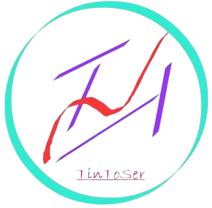

<div align="center">
  
  <h1>KnowsWell</h1>
  <p><strong>A portable Windows on-screen AI assistant — no installer, no runtime, single EXE.</strong></p>
</div>

---

## What it is

KnowsWell is a lightweight always-on-top AI assistant for Windows 10/11. It sits as a small pill on the top edge of your screen, stays invisible to screen-capture tools, and lets you snip any region, attach images, and ask questions — all without leaving your workflow.

Everything ships in a single `.exe`. No Python, no Electron, no installer. Drop it anywhere and run it.

---

## Features

| Feature | Detail |
|---------|--------|
| **Compact toolbar** | Always-on-top pill at the top of the screen, expands on click |
| **Display exclusion** | `WDA_EXCLUDEFROMCAPTURE` — never appears in screenshots or recordings |
| **Snip tool** | Drag any region → image auto-attaches to the next question |
| **Attachment strip** | Thumbnails with add/remove; import PNG / JPG / BMP / GIF from disk |
| **LLM streaming** | Tokens stream in real time into a translucent floating overlay |
| **Markdown rendering** | Headings, bullets, code blocks rendered via RichEdit |
| **Settings panel** | API key, model, endpoint, system prompt, opacity — via ⚙ |
| **Portable config** | `KnowsWell.json` lives next to the EXE; move the folder freely |
| **Ghost mode** | Toggle display affinity so the UI is hidden from all capture APIs |

---

## Quick Start

1. **Configure API access** — either:
   - Set the `OPENAI_API_KEY` environment variable, **or**
   - Run `KnowsWell.exe`, open ⚙ Settings, and paste your key there.
2. Run `KnowsWell.exe`.
3. Click **≡** to expand the toolbar.
4. *(Optional)* Click **✂** and drag a region on screen — it attaches automatically.
5. Click **✦** to open the chat bar, type your question, press **Ctrl+Enter**.
6. The answer streams into the floating overlay. Click **×** to dismiss.

---

## Keyboard & Mouse Reference

| Action | Shortcut |
|--------|----------|
| Submit question | `Ctrl+Enter` |
| Cancel streaming | `Esc` |
| Open snip tool | Click **✂** on toolbar |
| Remove attachment | Click the **×** on a thumbnail |
| Move toolbar | Drag the pill |
| Open settings | Click **⚙** |

---

## Compatible Backends

Any OpenAI-compatible endpoint with vision support works:

| Backend | Default endpoint |
|---------|-----------------|
| OpenAI | `https://api.openai.com/v1/chat/completions` |
| Anthropic (via proxy) | set endpoint + key in Settings |
| Ollama | `http://localhost:11434/v1/chat/completions` |
| LM Studio | `http://localhost:1234/v1/chat/completions` |
| Groq | `https://api.groq.com/openai/v1/chat/completions` |

Change the endpoint and model name in ⚙ Settings at any time without restarting.

---

## Configuration

`KnowsWell.json` is created next to the EXE on first run and auto-saved when you move the toolbar or close the app.

```jsonc
{
  "api_key":      "sk-...",
  "api_endpoint": "https://api.openai.com/v1/chat/completions",
  "model":        "gpt-4o",
  "max_tokens":   4096,
  "system_prompt": "You are a helpful assistant.",
  "toolbar_x":    100,
  "toolbar_y":    0,
  "opacity":      90,
  "ghost_mode":   false
}
```

---

## Build

### One command

```batch
build.bat
```

### Manual

```batch
set CGO_ENABLED=0
set GOOS=windows
set GOARCH=amd64
go build -ldflags="-H windowsgui -s -w" -o KnowsWell.exe .
```

**Requirements:** Go 1.21+, Windows 10/11 x64. No CGO, no external DLLs.

`logo.png` is compiled into the EXE via `//go:embed` — the binary is fully standalone.

---

## Architecture

```
KnowsWell/
├── main.go                  ← entry point, LockOSThread, message loop
├── go.mod
├── build.bat
├── KnowsWell.json           ← runtime config (auto-created, lives next to EXE)
├── logo.png                 ← embedded into the binary at build time
├── assets/
│   ├── icons.go             ← //go:embed logo.png → assets.LogoPNG
│   └── logo.png             ← copy used by the embed directive
└── internal/
    ├── config/
    │   └── config.go        ← JSON config load/save
    ├── capture/
    │   └── capture.go       ← Win32 GDI screen capture (BitBlt)
    ├── llm/
    │   └── client.go        ← OpenAI-compatible streaming HTTP client
    └── ui/
        ├── app.go           ← App struct, attachment list, stream buffer
        ├── callbacks.go     ← syscall.NewCallback WndProc wrappers
        ├── chatbar.go       ← query input + attachment strip window
        ├── draw.go          ← GDI drawing helpers + font cache
        ├── logo.go          ← decode embedded PNG → GDI DC for AlphaBlend
        ├── overlay.go       ← streaming response overlay (RichEdit)
        ├── rtf.go           ← Markdown → RTF converter
        ├── settings.go      ← settings panel window
        ├── snip.go          ← fullscreen snip selection window
        ├── toolbar.go       ← main toolbar pill + Run() message loop
        ├── win32.go         ← Win32 types, constants, lazy-loaded procs
        └── window.go        ← class registration, topmost, mouse tracking
```

### Key Design Points

- **Pure Win32, no CGO.** All Win32 calls go through `golang.org/x/sys/windows` lazy-loaded DLL procs (`windows.NewLazySystemDLL`). Zero external dependencies beyond the OS.
- **Single UI goroutine.** `runtime.LockOSThread()` in `init()` pins the goroutine to one OS thread for the entire lifetime. The LLM response goroutine posts back via `PostMessage` with a GC-safe string handle.
- **Double-buffered painting.** Every `WM_PAINT` handler creates a compatible off-screen DC and blits at the end — no flicker on resize or redraw.
- **WDA_EXCLUDEFROMCAPTURE.** All five app windows set display affinity so they are invisible to `BitBlt`-based capture, OBS, and the Windows snipping tool. Ghost mode makes it configurable at runtime.
- **Standalone binary.** `logo.png` is compiled in via `//go:embed`. The EXE + `KnowsWell.json` is everything you need.
- **Portable config.** Toolbar position, API settings and model name are persisted next to the EXE on every move or settings save.

---

## License

MIT
